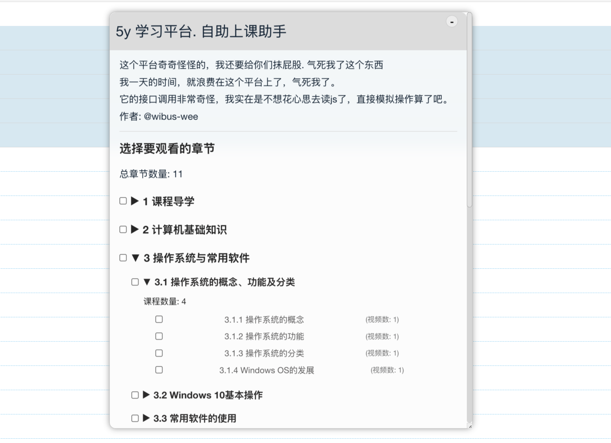

# 5Y 平台自助上课助手

> 不愿再碰。愿世上再无刷课。

## Preview

## Features

- 自动抓取课程观看章节
- 自助分章节点播，颗粒度到小节
- 平台记录观看进度，安全有效
- 关闭页面后自动记录当前进度，下次打开后继续观看
- 支持最小化 & 调整窗体大小
- 无隐私泄露，不记录用户信息

## Usage

### Requirements

- 5Y 平台
- 浏览器
- Tampermonkey

### Installation

[点击这里立即安装](https://github.com/wibus-dev/monkey-5y/raw/refs/heads/gh-pages/5y-lessons-helper.user.js)

## Author

5Y Helper © Wibus, Released under AGPLv3. Created on Oct 22, 2024

> [Personal Website](http://wibus.ren/) · [Blog](https://blog.wibus.ren/) · GitHub [@wibus-wee](https://github.com/wibus-wee/) · Telegram [@wibus✪](https://t.me/wibus_wee)
